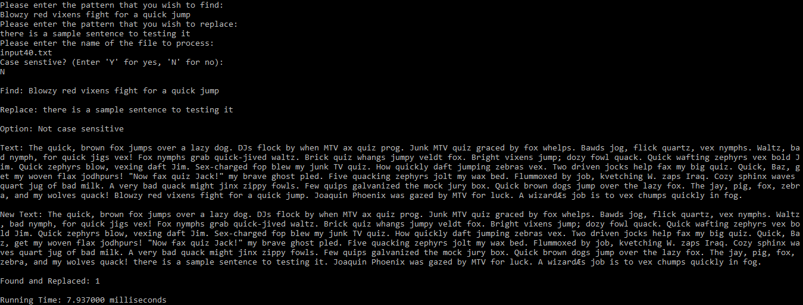

# Find and Replace by Horspool Algorithm
* The program which finds and replaces patterns given by user in a text file, implemented by using Boyer-Moore Horspool string search algorithm.

### What is Boyer-Moore Horspool Algorithm?
* Boyer-Moore-Horspool is an algorithm for finding substrings into strings. This algorithm compares each characters of substring to find a word or the same characters into the string. When characters do not match, the search jumps to the next matching position in the pattern by the value indicated in the Bad Match Table.

* The Bad Match Table indicates how many jumps should it move from the current position to the next.

* Boyer-Moore-Horspool is faster, simpler and optimized the searches of substrings. It has the following uses;
    * Searchbars
    * Auto-correctors
    * String Analyzers
    * Big Data
    * Text labeling

### Performance
* The Boyer-Moore-Horspool algorithm execution time is linear in the size of the string being searched. It can have a lower execution time factor than many other search algorithms.

* For one, it does not need to check all characters of the string. It skips over some of them with help of the Bad Match table.

* The algorithm gets faster as the substring being searched for becomes longer. This is because with each unsuccessful attempt to find a match between the substring and the string, the algorithm uses the Bad Match table to rule out positions where the substring cannot match.

(Information by nearsoft.com)

### Screenshots

